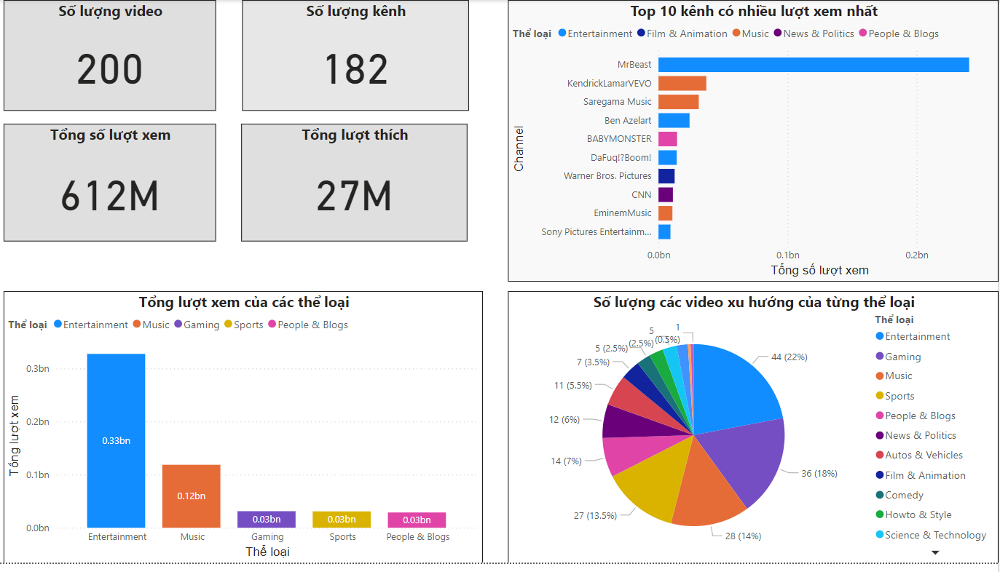

# Project Overview

This project is designed to pull the trending YouTube videos from the Google YouTube API (https://developers.google.com/youtube/v3) daily from VN region and store the data in a MSSQL database. The data is then digested in a PowerBI dashboard, allowing for insightful analysis and visualization of YouTube's trending content.

# Technology 

- Python: The programming language used for processing data and scheduling tasks
- Google API Client Library: For interacting with YouTube's API.
- Pandas: For preprocessing data.
- Airflow: For deciding the workflow of the tasks and scheduling the DAG.
- SQL Server: For storing the pulled data.
- PowerBI: For visualizing the data.

# Instructions on Implementing
## Installation : 
- SQL Server 
- PowerBI
- Python 3.x
- Apache Airflow in Docker : [Airflow Setup](./dags/README.md)

# Dashboard 

